# Bikeblog App

## Screenshot of finished project responsivness
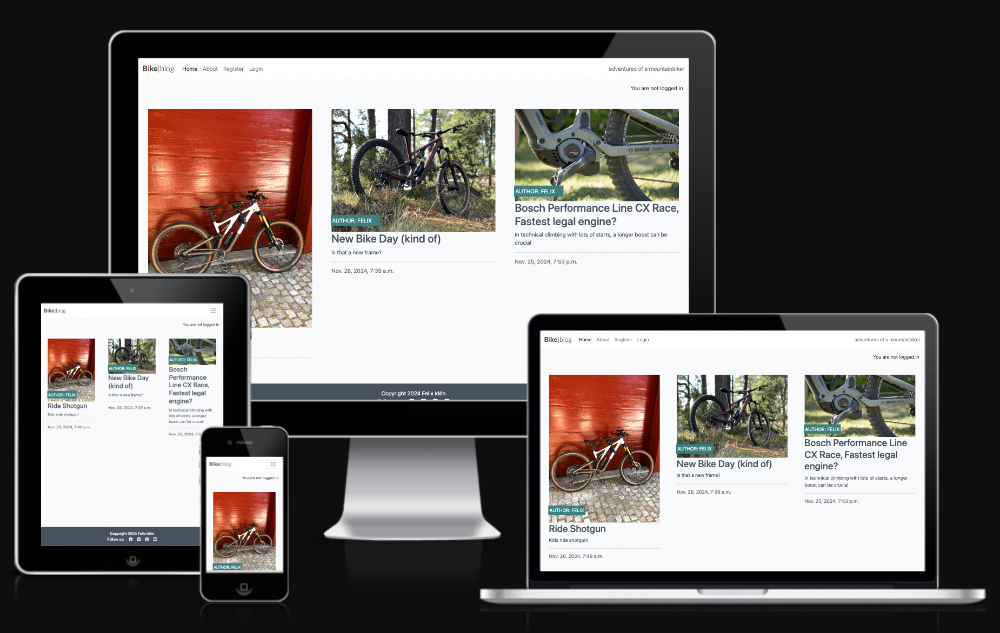

> This is an easy to use application that allows users to read blogposts with interesting content associated to mountainbikes.
> The user can create their own username and log in to make comments on posts and interact with others.
> The posts are written by the sites admins, who also controls if comments gets approved. This way the site can avoid explicit or offensive language.
# Live App
[Bikeblog](https://bike-blog-9220ce15bd18.herokuapp.com/)

## Table of Contents

<a name="contents">Back to top</a>

1. [UX](#ux)
2. [User Demographic](#user-demographic)
3. [Design](#design)
4. [User Stories](#user-stories)
5. [Database Schema](#database-schema)
6. [Features](#features)
7. [Existing Features](#existing-features)
8. [Features Left to Implement](#features-left-to-implement)
9. [Technologies Used](#technologies)
10. [Agile Development](#agile-development)
11. [Testing](#testing)
12. [Bug](#bugs)
13. [Deployment](#deployment)
14. [Credits](#credits)

## UX

### User Demographic

This application is designed for users who want's to read blogposts about mountainbiking. 
The app is designed with responsivness in mind and to be viewed on a mobile device.

### Design

- Color Palette
  For the fonts i used (#4A4A4F) a dark grey color that has great depth without making it to harsh to read. It provides a modern feel that ensures great readability for the user. It's paired with a white background with some hints of lightgray (#F9FAFC).
  The buttons use a slighlty darker version of turquoise that attracts the eye and pairs together with white text. 
  
- Typography

  The typography choices reflect clarity and contemporary design
  Fonts used are Lato & sans-serif as fallback.
  The fonts are selected not only for their visual harmony but also for their high readability, contributing to a user-friendly 
  experience.

### User Stories

User stories can be found in the github projects board. Unfinished stories are reflected on in the section features-left-to-implement

[User Stories](https://github.com/users/Felixiden1987/projects/3)

### Database Schema

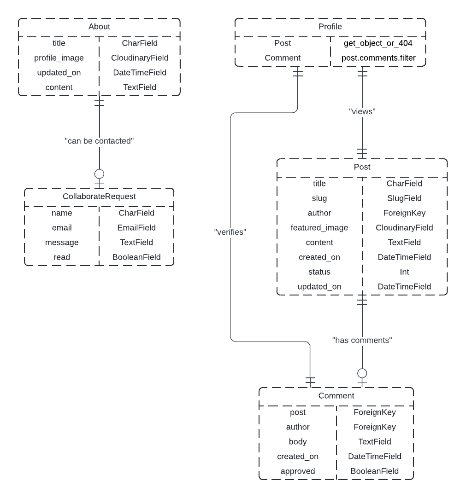

#### Post Model

| id            | Field         |            
| ------------- | ------------- |
| title         | CharField     |
| slug          | SlugField     |
| author        | ForeignKey    |
| featured_image|CloudinaryField| 
| content       | TextField     |
| created_on    | DateTimeField | 
| status        | Integer       |
| updated_on    | DateTimeField |

#### Profile Model

| id          | Field                |
| ----------- | -------------------- |
| post        | get_object_or_404    |
| comments    | post.comments.filter |

#### Comment Model

| id                    | Field         |
| --------------------- | ------------- |
| post                  | ForeignKey    |
| author                | ForeignKey    |
| body                  | TextField     |
| created_on            | DateTimeField |
| approved              | BooleanField  |

#### About Model

| id            | Field         |
| ------------- | ------------- |
| title         | Charfield     |
| profile_image |CloudinaryField|
| updated_on    | DateTimeField |
| content       | TextField     |

#### CollaborateRequest Model

| id            | Field         |
| ------------- | ------------- |
| name          | CharField     |
| email         | EmailField    |
| message       | TextField     |
| read          | BooleanField  |

## Features

### Existing Features

Landing Page, users can read blogposts and about page, users can also register or login.

Register Page, users can register with their username, email address, password and confirm password.

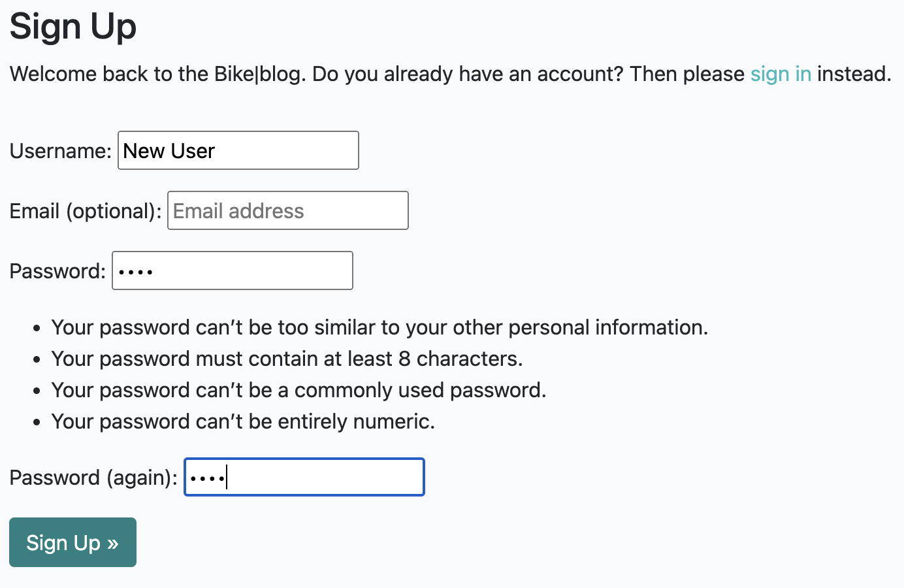

Login Page, users can login with their username and password.

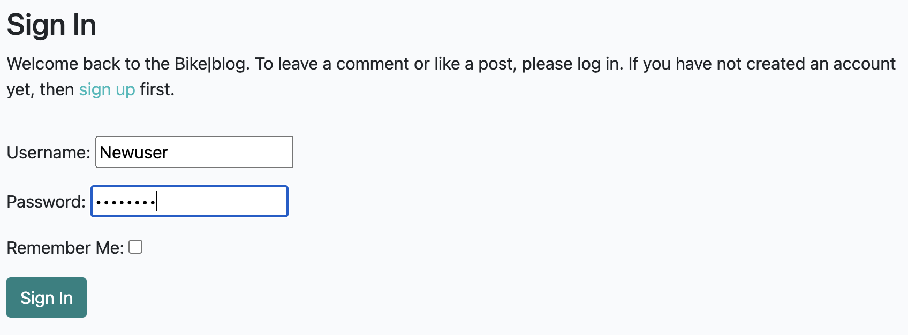

CRUD functionality, logged in users can create, read, update and delete their own comments
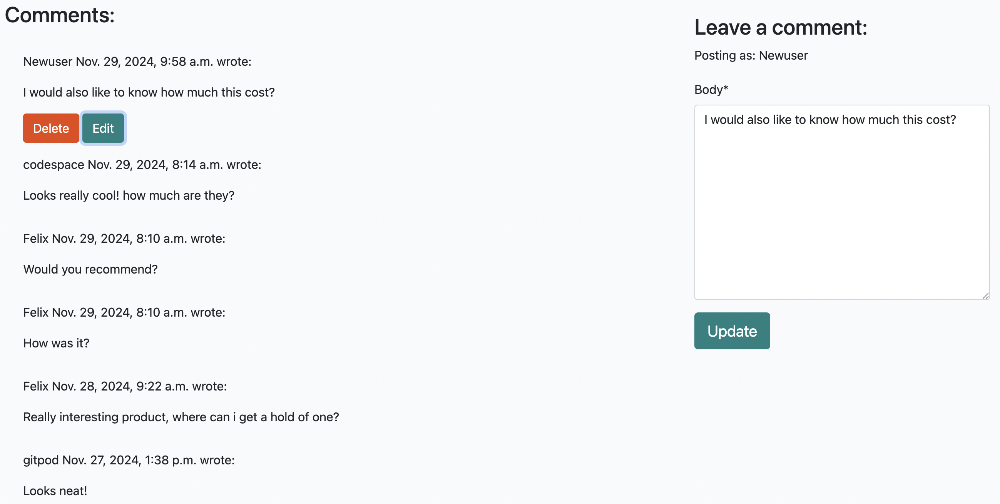

View Profile, logged in users can view their comments in their profile.

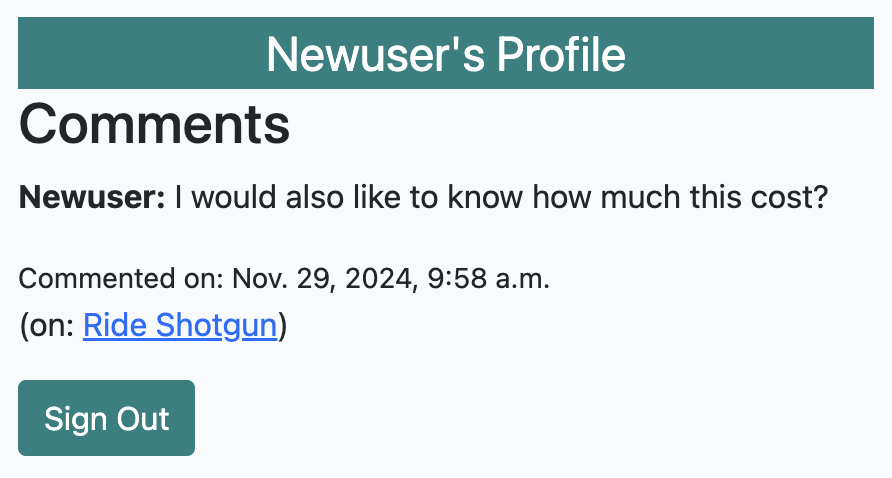

About page, users can get information about the blog and fill out a form if they would like to collaborate to write posts etc.

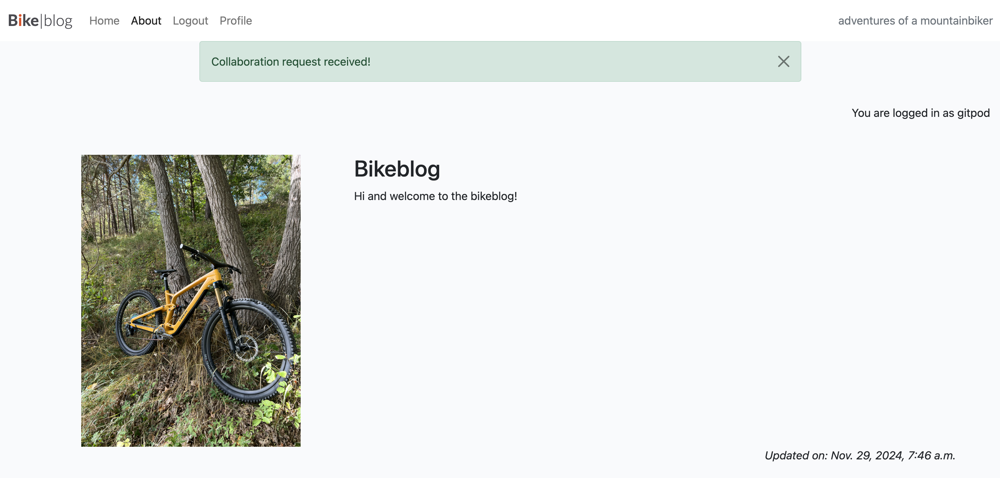
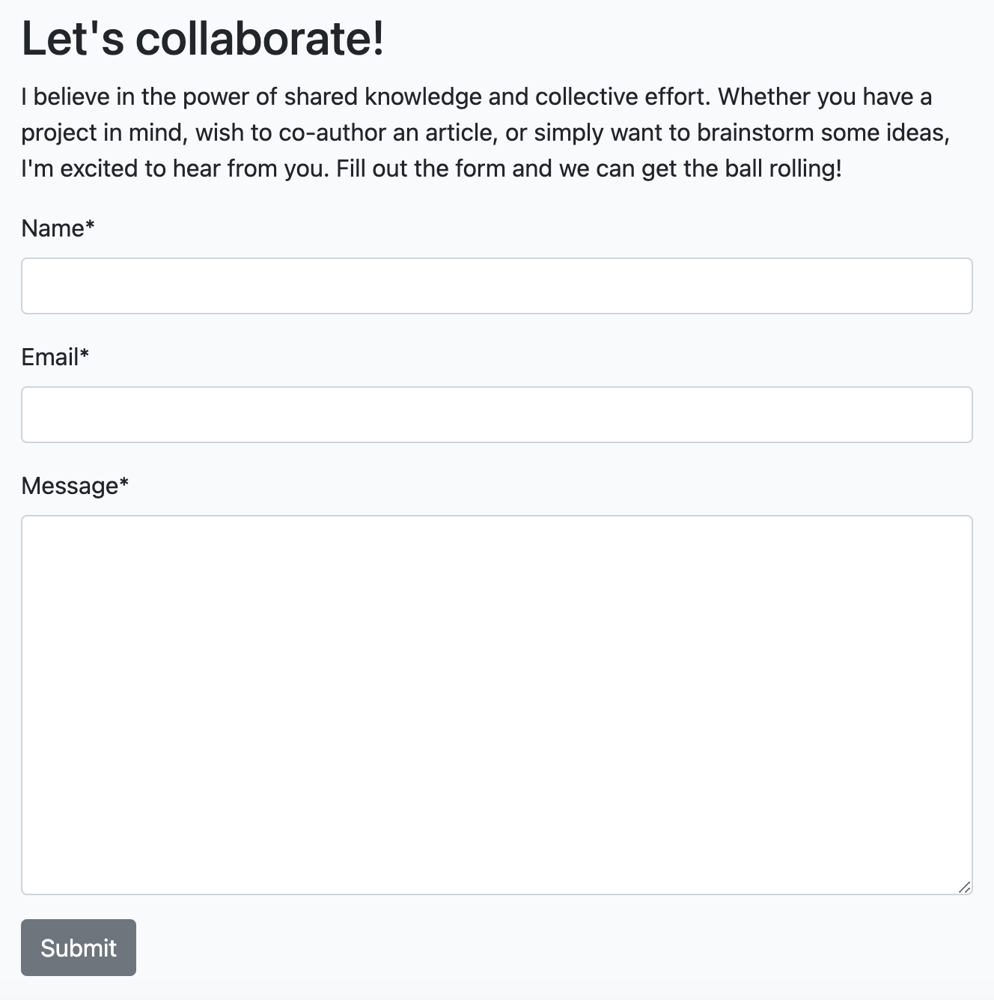

Django Admin Panel, when appending /admin at the end of the url you get access to the built in admin panel, (if you are a user with that credentials.) 
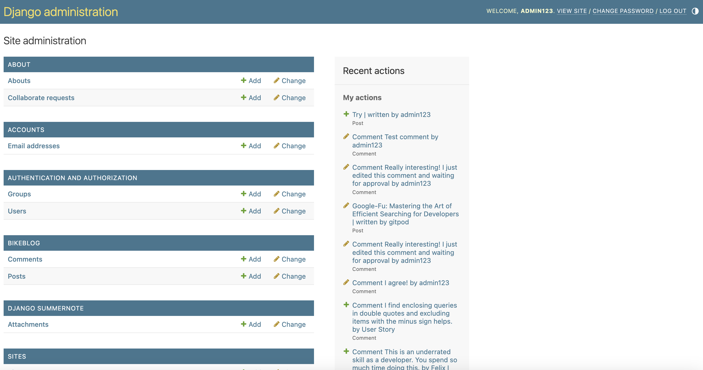

### Features Left to Implement

- Like post and comments with a thumbs up. A nice to have feature but is not done due to time constraints.

## Technologies Used

Languages Used

- HTML5

- CSS3

- JavaScript

- Python

Frameworks, Libraries & Programs Used

- Django:

  - The Django web framework was used to create the full-stack web application. Provides a ready installed admin panel and includes many helper template tags that make writing code quick and efficient.

- PostgreSQL:

  - PostgreSQL was used as database system.

- Git:

  - Git was used for version control by utilizing the Gitpod terminal to commit to Git and Push to GitHub.

- GitHub:

  - GitHub is used to store the projects code after being pushed from Git.

- Heroku:

  - Heroku was used for the deployed application.

- Gunicorn

  - A Python WSGI HTTP server for UNIX, used to run Python web applications.

- DJ-Database-URL

  - A utility to help you load your database into your dictionary from the DATABASE_URL environment variable.

- PEP 8

  - A tool to check Python code against some of the style conventions in PEP 8.

## Agile Development

https://github.com/users/Felixiden1987/projects/

Github projects was used for the agile development of this project. The purpose for this was to layout the tasks that needed to be completed and to track the progress of the project. All user stories can be found in the github projects board.

## Testing

- Testing was completed manually and with automated testing using Django's built in testing framework.

### Manual Testing

| **TEST**                      | **ACTION**                                                                                                                                                                                       | **EXPECTATION**                                                                                | **RESULT**              |
| ----------------------------- | ------------------------------------------------------------------------------------------------------------------------------------------------------------------------------------------------ | ---------------------------------------------------------------------------------------------- | ----------------------- |
| User Registration             | User registration was tested by creating a new user account and checking that the user can access the user profile.                                   | User can access user profile after successful registration                                                                                                                       | Works as expected       |
| User Login                    | User login was tested by logging in with a valid user account and checking that the user can access the users profile.                                                                   | User can access users profile after successful login                                     | Works as expected       |
| Navigation                    | Navigation was tested by clicking the nav links and checking that the user was redirected to the correct view.                                                       | User is redirected to the correct view after clicking the nav link                                                                                                                 | Works as expected       |
| View comments in profile             | Viewing comments was tested by logging in to /admin and approve comment, then log in as the user of the comment waiting for approval   | User can view their comments in profile after approval from admin                                                                                                                       | Works as expected       |

### Automated Testing

- I tested some of my views but due to time constraints i was not able to test all of them. I would like to do more testing in the future.

| **TEST**             | **ACTION**                                    | **EXPECTATION**                                                                                      | **RESULT** |
| -------------------- | --------------------------------------------- | ---------------------------------------------------------------------------------------------------- | ---------- |
| Profile View            | GET request to profile                      | Status code is 200 and correct template is used, template include the comments we created                                                      | Passed     |
| Not logged in profile view  | GET request to login page                  | Status code is 302, redirected to login                                                                                   | Passed     |

### CI Python Linter Validation Results

All Python files were validated using CI linter. 
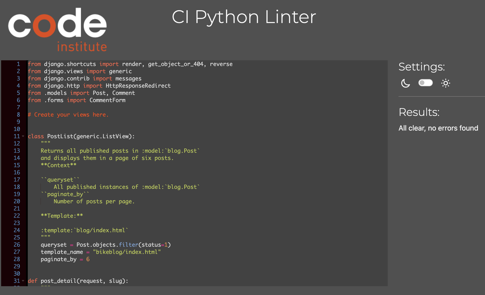

### CSS Validation Results
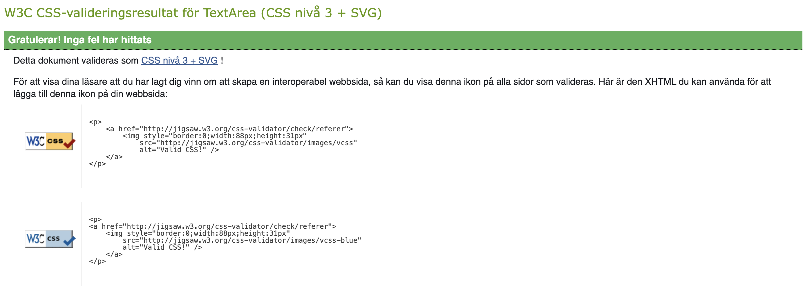

### HTML Validation Results
- Each pages source code was placed into the W3C Markup Validation Service. All pages passed.
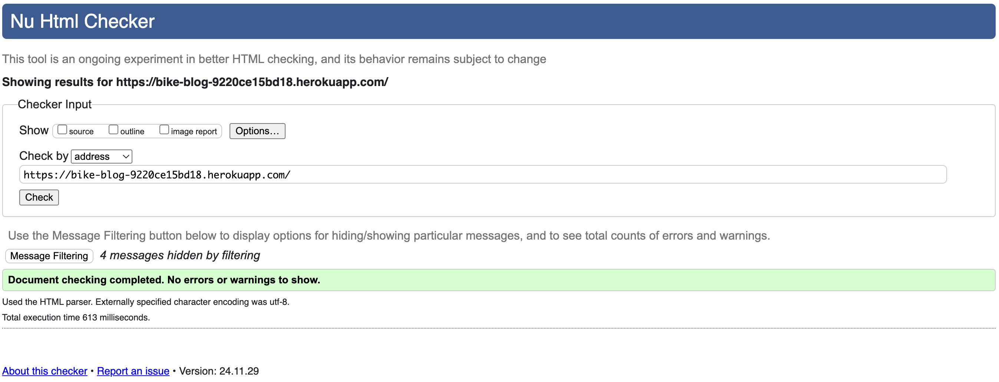

### Google Lighthouse Results
- Best Practices levels are low due to cloudinary using http protocol instead of https. Since I'm using the free version i can't change this at the moment.
- Performance levels are low due to images not having an explicit width and height. Images are large in size too, i tried to go from png to webp and it just got slightly better. 
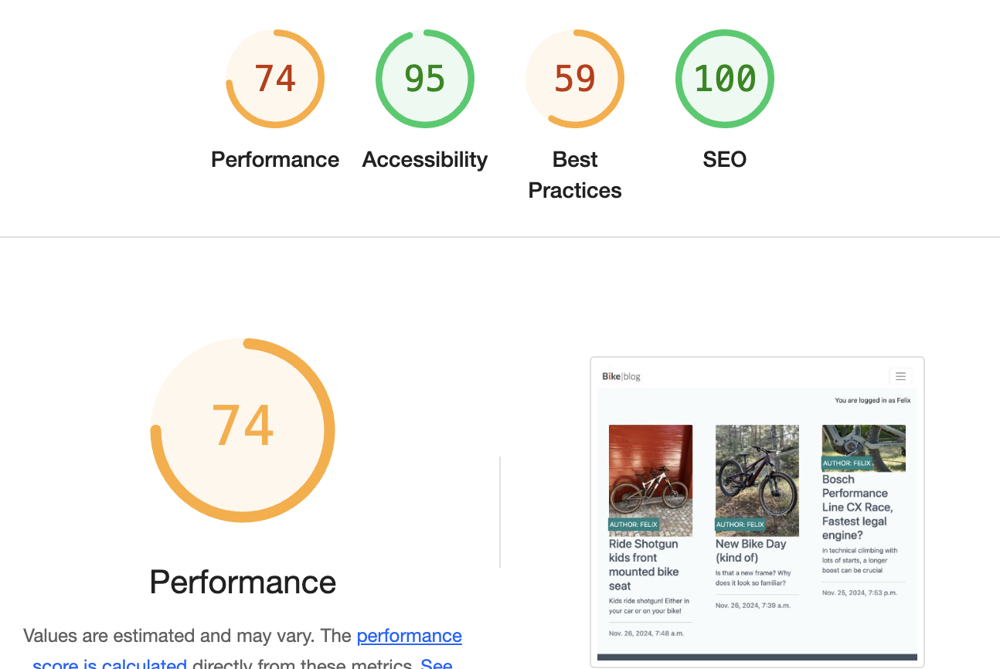
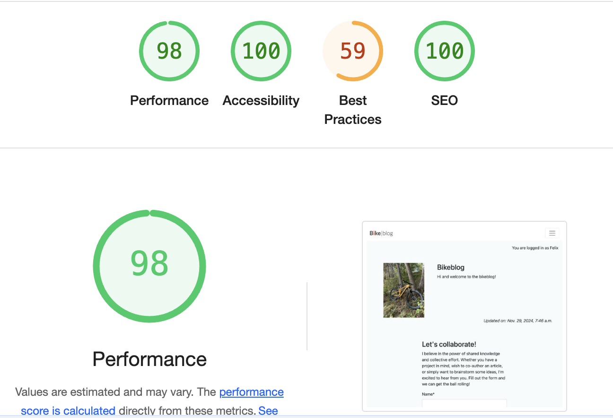
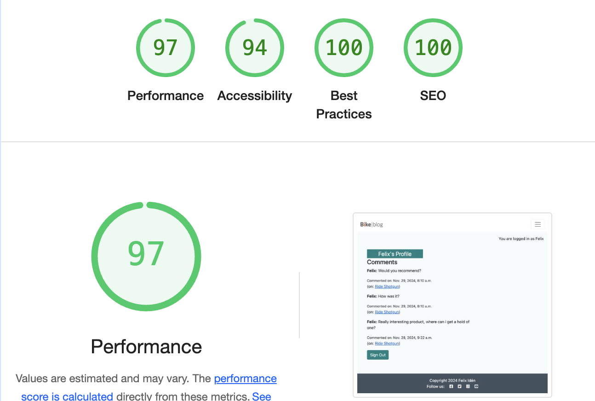

### Responsiveness Testing
- The app was tested on a range of devices and browsers to ensure compatibility and responsiveness.
- Browsers tested are Chrome, Safari and Firefox.
- Devices tested are Macbook air, Imac and Iphone 13. 

## Bugs

- No existing bugs detected.
- Previously i had issues with my database, which i put many hours trying to get it to work, once contacted with tutor support we could eventually determine that i needed to change database due to errors we couldn't fix.

## Deployment

### Heroku Deployment
1. Create a Heroku account by going to https://signup.heroku.com/
2. Create a new app by clicking the "New" button in the top right corner and then click "Create new app".
3. Enter a name for the app and select the region closest to you.
4. Click the "Create app" button.
5. Select "settings" from the top menu.
6. Click the "Reveal Config Vars" button.
7. Enter the following environment variables with your values:
  - SECRET_KEY
  - DATABASE_URL
8. Click the "Deploy" tab from the top menu.
9. Click the "Connect to GitHub" button.
10. Search for your repository and click the "Connect" button.
11. Click the "Enable Automatic Deploys" button.
12. Click the "Deploy Branch" button.
13. Click the "View" button to launch the app.

### Local Deployment
1. Clone the repository by clicking the "Clone or download" button in github.
2. In your IDE open a new terminal.
3. Change the current working directory to the location where you want the cloned directory to be made.
4. Type git clone, and then paste the URL you copied in Step 2.
5. Press Enter. Your local clone will be created.
6. Create a virtual environment by typing python -m venv venv in the terminal.
7. Activate the virtual environment by typing venv\bin\activate in the terminal.
8. Install the requirements by typing pip install -r requirements.txt in the terminal.
9. Create a .env file in the root directory and add the following environment variables:
  - os.environ.setdefault("DATABASE_URL", "xxxxxxxxx")
  - os.environ.setdefault("SECRET_KEY", "xxxxxxxxxx")
  - os.environ.setdefault("DEBUG", "False || True")
10. Migrate the database by typing python manage.py makemigrations and then python manage.py migrate in the terminal.
11. Create a superuser by typing python manage.py createsuperuser in the terminal.
12. Run the app by typing python manage.py runserver in the terminal.

## Credits

The code for the main part of the project is from "I think therefore i blog" due to time constraints.
I have then added a custom model for the profiles page. Where the user can see their comments linked to the posts of their comments.
I used the following resources to help me complete this project.

- Code Institute Material
